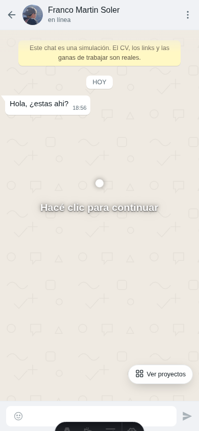
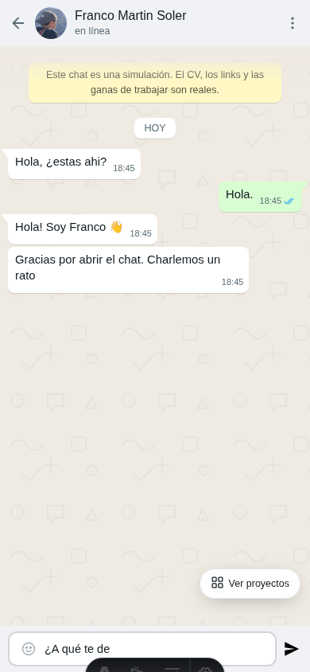
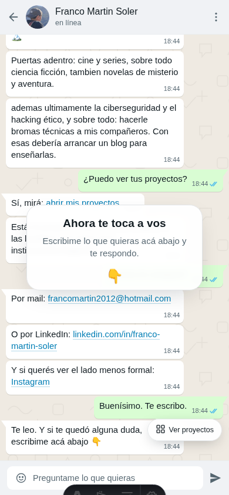
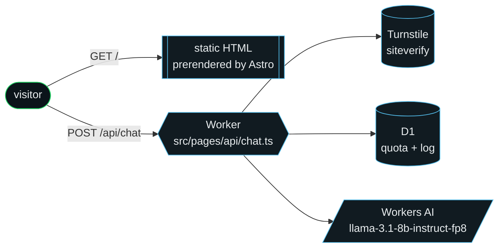
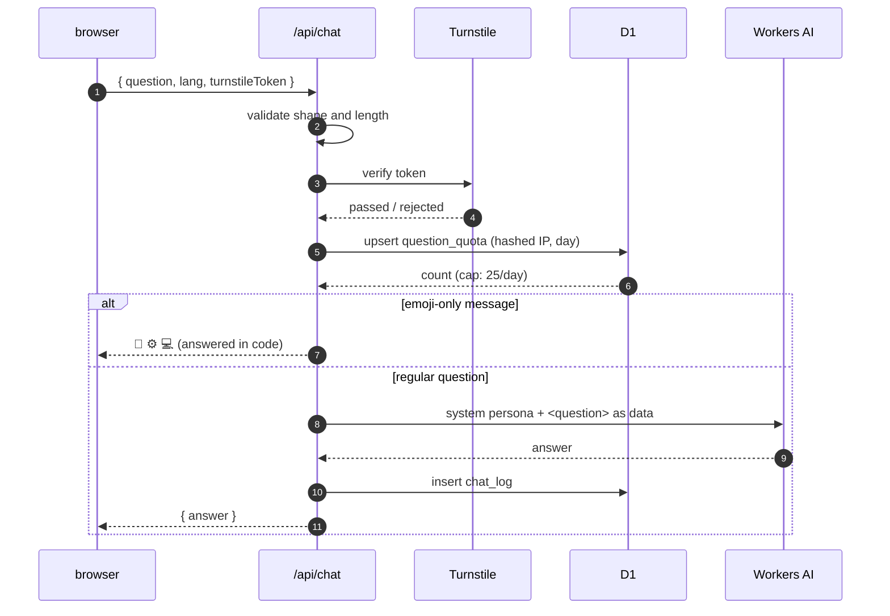

<div align="center">



<br>

[](https://francosolersistemas.com)


</div>

```text
┌──────────────────────────────────────────────────────────────────────┐
│  SYSTEM.INFO                                                         │
├──────────────────────────────────────────────────────────────────────┤
│  > what      a portfolio that is a chat, not a page                  │
│  > how       tap through the scripted intro, then ask anything       │
│  > who       an AI persona answers in first person, ES / EN          │
│  > where     static HTML on Cloudflare + one Worker route            │
│  > status    ██████████████████████████████  ONLINE                  │
└──────────────────────────────────────────────────────────────────────┘
```

## `01` // The interface

Each tap plays one exchange. The scripted visitor question is typed into the
composer letter by letter and sent, then Franco types and answers. When the script
ends, the chat scrolls natively and opens up to real questions.

<div align="center">

| `[ boot ]` | `[ typing… ]` | `[ your turn ]` |
| :---: | :---: | :---: |
|  |  |  |
| A pulsing hint asks for a tap | The draft takes 1–2 s, then it is sent | Ask anything or pick a suggested question |

</div>

## `02` // Architecture



Every page is prerendered to static HTML. Only `/api/chat` runs on the Worker.

## `03` // Request pipeline



## `04` // Source map

```text
src/
├── components/     ▸ ChatPanel, ProjectsPanel, Intro, Avatar …
├── data/           ▸ scripted messages, profile, projects (ES / EN)
├── i18n/           ▸ UI copy and language routing
├── lib/persona.ts  ▸ the system prompt and the daily limit
├── pages/
│   ├── index.astro ▸ /      (Spanish)
│   ├── en/         ▸ /en/   (English)
│   └── api/chat.ts ▸ the only server route
├── scripts/        ▸ tap-driven chat, typing drafts, Turnstile, theme
└── styles/         ▸ landing.css, with light and dark themes
db/schema.sql       ▸ D1 tables: question_quota, chat_log
public/_headers     ▸ security headers for static responses
```

## `05` // Boot sequence

```sh
$ npm install
$ npx wrangler d1 execute portfolio --local --file=db/schema.sql   # once
$ npm run dev        # http://localhost:4321
$ npm run build      # dist/client (static) + dist/server (Worker)
$ npm run deploy     # build + wrangler deploy
```

> [!NOTE]
> Workers AI has no local emulation. With the `ai` binding enabled, `astro dev`
> opens a remote proxy session, so run `npx wrangler login` first. If the binding
> is absent in dev, `/api/chat` answers with a `[STUB LOCAL …]` placeholder; that
> path is guarded by `import.meta.env.DEV`. Turnstile is skipped in dev when
> `TURNSTILE_SECRET` is not set.

<details>
<summary><b>▸ Database</b></summary>

```sh
npx wrangler d1 create portfolio                       # paste the id into wrangler.jsonc
npx wrangler d1 execute portfolio --local  --file=db/schema.sql
npx wrangler d1 execute portfolio --remote --file=db/schema.sql
```

</details>

<details>
<summary><b>▸ Secrets</b></summary>

```sh
npx wrangler secret put IP_SALT            # random string; salts the stored IP hashes
npx wrangler secret put TURNSTILE_SECRET   # Turnstile widget secret for siteverify
```

</details>

<details>
<summary><b>▸ Types</b></summary>

```sh
npm run cf-typegen   # regenerate worker-configuration.d.ts after editing wrangler.jsonc
```

</details>

<div align="center">

```text
> connection closed by remote host. thanks for reading_
```

</div>
